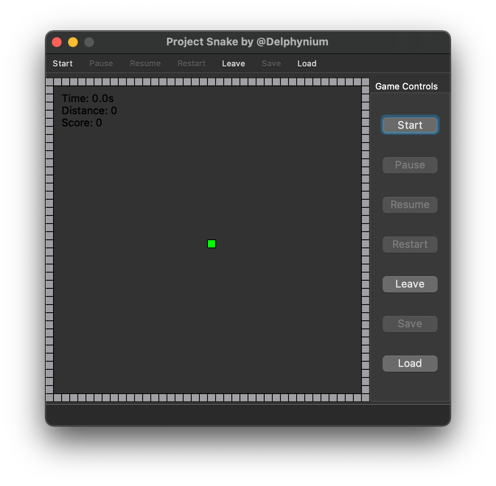

# Project Snake

基于 Qt5，使用 C++ 实现的贪吃蛇游戏。

支持存档、读档功能。

图形界面是在 macOS Catalina 和 Big Sur 上进行测试的，其他平台不保证长得一样。

> 注：本项目曾为清华大学计算机系  2020 年夏程序设计训练课程作业。当时攥写的设计文稿见于 `report.pdf`。

## 运行方法

Qt Creator 打开 `proj_snake.pro`，执行 qmake、构建项目，最后运行即可。

## 效果

